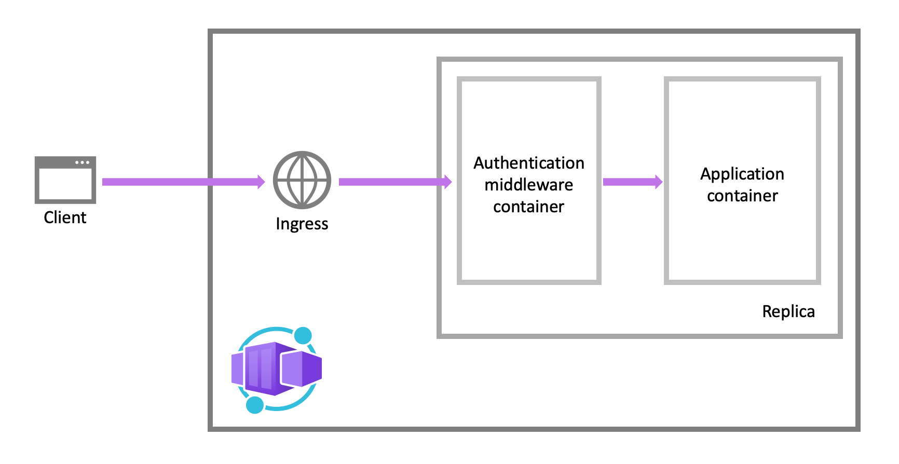

# Azure Container Apps Authentication

Azure Container Apps provides **built-in authentication and authorization features** to secure your external ingress-enabled container app with minimal or no code.

Azure Container Apps provides access to various built-in authentication providers.

The built-in auth features don’t require any particular language, SDK, security expertise, or even any code that you have to write.

This feature should only be used with HTTPS. Ensure `allowInsecure` is disabled on your container app's ingress configuration. You can configure your container app for authentication with or without restricting access to your site content and APIs.

To restrict app access only to authenticated users, set its Restrict access setting to *Require authentication*.
To authenticate but not restrict access, set its Restrict access setting to *Allow unauthenticated access*.

You can use [[federated-identity]], in which a third-party identity provider manages the user identities and authentication flow. You can use several IdP, such as Microsoft, Facebook, GitHub and more.

**The authentication component runs as a sidecar container** on each replica in your application. When enabled, every incoming HTTP request passes through the security layer before being handled by your application. The middleware manages the sessions and **inject the identity information into HTTP request headers**.

The authentication and authorization module runs in a separate container, isolated from your application code. As the security container doesn't run in-process, **no direct integration with specific language frameworks is possible**. However, relevant information your app needs is provided in request headers.

There are two authentication flows:

* **Without provider SDK (server-directed flow or server flow)**: The application delegates federated sign-in to Container Apps. Delegation is typically the case with browser apps, which presents the provider's sign-in page to the user.
* **With provider SDK (client-directed flow or client flow)**: The application signs users in to the provider manually and then submits the *authentication token* to Container Apps for validation. This approach is typical for browser-less apps that don't present the provider's sign-in page to the user. An example is a native mobile app that signs users in using the provider's SDK.
