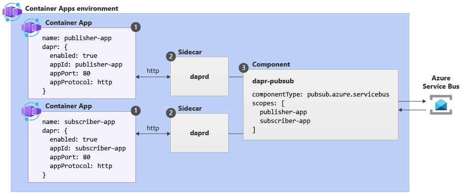

# Azure Container Apps with Dapr

As an alternative to deploying and managing the [[Dapr]] OSS project yourself, the Container Apps platform:

- Provides a managed and supported Dapr integration
- Handles Dapr version upgrades seamlessly
- Exposes a simplified Dapr interaction model to increase developer productivity

Once enabled (via CLI, Portal, or ARM), you can use Dapr to perform external operations.

Each component has a set of settings that express how stuff work together.

In the previous example:

|Label|Dapr settings|Description|
|--|--|--|
|1|Container Apps with Dapr enabled |Dapr is enabled at the container app level by configuring a set of Dapr arguments. These values apply to all revisions of a given container app when running in multiple revisions mode.|
|2| Dapr| The fully managed Dapr APIs are exposed to each container app through a Dapr sidecar. The Dapr APIs can be invoked from your container app via HTTP or gRPC. **The Dapr sidecar runs on HTTP port 3500 and gRPC port 50001**.|
|3 |Dapr component configuration| Dapr uses a modular design where functionality is delivered as a component. Dapr components can be shared across multiple container apps. The Dapr app identifiers provided in the scopes array dictate which dapr-enabled container apps load a given component at runtime.|

Two Dapr applications can communicate only if they live in the same ACA environment.

Dapr uses a modular design where functionality is delivered as a **component**. The use of Dapr components is optional and dictated exclusively by the needs of your application.

Dapr components in container apps are *environment-level resources* that:

- Can provide a pluggable abstraction model for connecting to supporting external services.
- Can be shared across container apps or scoped to specific container apps.
- Can use Dapr secrets to securely retrieve configuration metadata.

By default, all Dapr-enabled container apps within the same environment load the full set of deployed components. To ensure components are loaded at runtime by only the appropriate container apps, application scopes should be used.
