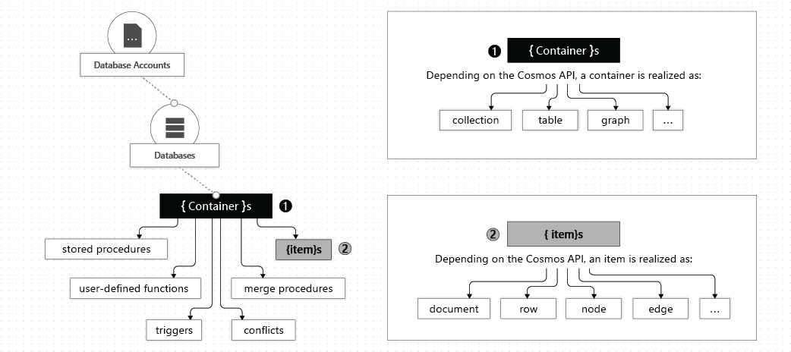

# Azure Cosmos DB

Azure Cosmos DB is a **fully managed NoSQL database** designed to provide low latency, elastic scalability of throughput, well-defined semantics for data consistency, and high availability.

You can configure your databases to be globally distributed and available in any of the [[azure-region]]. To lower the latency, place the data close to where your users are.

It uses **multi-master replication protocol**, meaning that all regions support both reads and writes. Multi-master replication protocol provides some functionalities:

- Unlimited elastic write and read scalability.
- 99.999% read and write availability all around the world.
- Guaranteed reads and writes served in less than 10 milliseconds at the 99th [[percentile]].

However, you can configure it to have only one region enabled for writing.

Your application can perform near **real-time reads and writes against all the regions** you chose for your database. Azure Cosmos DB internally handles the data replication between regions with consistency level guarantees of the level you've selected.

To use CosmoDB you have to create a [[azure-cosmos-db-account]]. Every account can have one or more [[azure-cosmos-db-database]], each containing one or more [[azure-cosmos-db-container]]. Each container then is a collection of [[azure-cosmos-db-item]].

For each account you can define its [[azure-cosmos-db-consistency-levels]].

With Azure Cosmos DB, you pay for the throughput you provision and the storage you consume on an hourly basis. Throughput must be provisioned to ensure that sufficient system resources are available for your Azure Cosmos database always. DB operations are expressed in [[azure-cosmos-db-request-units]].

Azure Cosmos DB encryption protects your data at rest by seamlessly encrypting your data as it's written in our datacenters, and automatically decrypting it for you as you access it.

## Stored procedures, Triggers, User-defined functions

With Azure Cosmos DB you can use **Stored Procedures, Triggers, and User-Defined Functions**. To call a stored procedure, trigger, or user-defined function, you need to register it.

See [[azure-cosmos-db-stored-procedures]], [[azure-cosmos-db-triggers]], and [[azure-cosmos-db-user-defined-functions]].

## Backup

You can define backup policies for your data.

- **Periodic**: backup is taked at periodic intervals, based on configuration.
- **Continuous**: provides a backup window of 7 or 30 days. You can restore data available at any moment in that specific time window.

Backup can be stored redundantly, using either Local-redundant storage or Geo-redundant storage.

## Available APIs

- **NoSQL**: data is stored in document format. **It's the default API**. It supports querying using SQL syntax.
- **MongoDB**: data is stored in documents using BSON format.
- **PostgreSQL**: allows for distributed tables. Data is stored either on a single node or in a multi-node configuration.
- **[[apache-cassandra]]**: data is stored in a **column-oriented schema**. Good for large volumes of data.
- **Apache Gremlin**: creates graphs where data is stored as edges and vertices.
- **Table**: it stores data in **key/value format**. If you're currently using Azure Table storage, you may see some limitations in latency, scaling, throughput, global distribution, index management, low query performance. API for Table overcomes these limitations and it's recommended to migrate your app if you want to use the benefits of Azure Cosmos DB. API for Table only supports [[OLTP]] scenarios.

## Partitions

You have to define partitions to spread the content to all the instances.

You can create logical partition (defined in each item). Azure automatically creates physical partitions, and each physical partition can contain one or more logical partitions.

[[cosmosdb partitions]]

When your system is heavy read, you should define as a partition key one of the field used the most when defining queries.

[[syntetic partition key]]

## Change Feed

Change feed in Azure Cosmos DB is a **persistent record of changes to a container in the order they occur**.

Change feed support in Azure Cosmos DB works by listening to an Azure Cosmos DB container for any changes. It then outputs the sorted list of documents that were changed in the order in which they were modified.

**The persisted changes can be processed asynchronously and incrementally**, and the output can be distributed across one or more consumers for parallel processing.

Today, you see all inserts and updates in the change feed. **You can't filter the change feed for a specific type of operation**. Currently change feed **doesn't log delete operations**. As a workaround, you can add a soft marker on the items that are being deleted. For example, you can add an attribute in the item called "deleted," set its value to "true," and then set a time-to-live (TTL) value on the item. Setting the TTL ensures that the item is automatically deleted.

You can work with the Azure Cosmos DB change feed **using either a push model or a pull model**.
With a push model, the change feed processor pushes work to a client that has business logic for processing this work. However, the complexity in checking for work and storing state for the last processed work is handled within the change feed processor. It is recommended to use the push model because you won't need to worry about polling the change feed for future changes, storing state for the last processed change, and other benefits.
With a pull model, the client has to pull the work from the server. The client, in this case, not only has business logic for processing work but also storing state for the last processed work, handling load balancing across multiple clients processing work in parallel, and handling errors.

There are two ways you can read from the change feed with a push model: **[[azure-functions]] with Azure Cosmos DB triggers**, and the **change feed processor library**. Azure Functions uses the change feed processor behind the scenes, so these are both similar ways to read the change feed.
