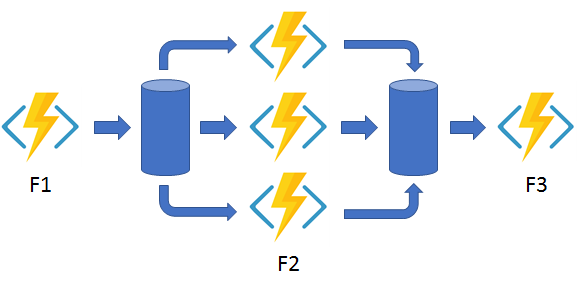
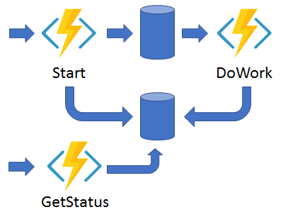

# Azure Durable Functions

Durable Functions is an extension of Azure Functions that lets you **write stateful functions in a serverless compute environment**.

The extension lets you define stateful workflows by writing **orchestrator functions** and **stateful entities** by writing entity functions using the Azure Functions programming model.

Behind the scenes, the extension manages state, checkpoints, and restarts for you, allowing you to focus on your business logic.

The primary use case for Durable Functions is simplifying complex, stateful coordination requirements in serverless applications. Examples of typical application patterns that can benefit from Durable Functions are:

- Function chaining
- Fan-out/fan-in
- Async HTTP APIs
- Monitoring
- Human interaction
- Aggregator (stateful entities)

## Function Chaining

The output of a function can be used as input for the next function.


In the following snippet, F1 to F4 are the functions called by this orchestrator function.

```cs
[Function("Chaining")]
public static async Task<object> Run(
    [OrchestrationTrigger] TaskOrchestrationContext context)
{
    try
    {
        var x = await context.CallActivityAsync<object>("F1", null);
        var y = await context.CallActivityAsync<object>("F2", x);
        var z = await context.CallActivityAsync<object>("F3", y);
        return  await context.CallActivityAsync<object>("F4", z);
    }
    catch (Exception)
    {
        // Error handling or compensation goes here.
    }
}
```

It's important to always use the `context` variable to ensure that the underneath state machine keeps track of the current state.

## Fan out / Fan in

It's when you execute multiple functions in parallel and then aggregate the result.



```cs
[Function("FanOutFanIn")]
public static async Task Run(
    [OrchestrationTrigger] TaskOrchestrationContext context)
{
    var parallelTasks = new List<Task<int>>();

    // Get a list of N work items to process in parallel.
    object[] workBatch = await context.CallActivityAsync<object[]>("F1", null);
    for (int i = 0; i < workBatch.Length; i++)
    {
        Task<int> task = context.CallActivityAsync<int>("F2", workBatch[i]);
        parallelTasks.Add(task);
    }

    await Task.WhenAll(parallelTasks);

    // Aggregate all N outputs and send the result to F3.
    int sum = parallelTasks.Sum(t => t.Result);
    await context.CallActivityAsync("F3", sum);
}
```

## Async HTTP APIs

The async HTTP API pattern addresses the problem of coordinating the state of long-running operations with external clients.



It manages long-running executions by providing a built-in endpoint that must be called to check if the remote operation has finished.

## Monitoring

The monitor pattern refers to a flexible, recurring process in a workflow.

An example is polling until specific conditions are met. You can use a regular timer trigger to address a basic scenario, such as a periodic cleanup job, but its interval is static and managing instance lifetimes becomes complex. You can use Durable Functions to create flexible recurrence intervals, manage task lifetimes, and create multiple monitor processes from a single orchestration.

An example of the monitor pattern is to reverse the earlier async HTTP API scenario. Instead of exposing an endpoint for an external client to monitor a long-running operation, the long-running monitor consumes an external endpoint, and then waits for a state change.

```cs
[Function("MonitorJobStatus")]
public static async Task Run(
    [OrchestrationTrigger] TaskOrchestrationContext context, int jobId)
{
    int pollingInterval = GetPollingInterval();
    DateTime expiryTime = GetExpiryTime();

    while (context.CurrentUtcDateTime < expiryTime)
    {
        var jobStatus = await context.CallActivityAsync<string>("GetJobStatus", jobId);
        if (jobStatus == "Completed")
        {
            // Perform an action when a condition is met.
            await context.CallActivityAsync("SendAlert", jobId);
            break;
        }

        // Orchestration sleeps until this time.
        var nextCheck = context.CurrentUtcDateTime.AddSeconds(pollingInterval);
        await context.CreateTimer(nextCheck, CancellationToken.None);
    }

    // Perform more work here, or let the orchestration end.
}
```

Note the usage of `context.CurrentUtcDateTime`!

## Human interaction

The orchestrator uses a durable timer to request approval.

The orchestrator escalates if timeout occurs. **The orchestrator waits for an external event, such as a notification that's generated by a human interaction**.

```cs
[Function("ApprovalWorkflow")]
public static async Task Run([OrchestrationTrigger] TaskOrchestrationContext context)
{
    await context.CallActivityAsync("RequestApproval", null);
    using (var timeoutCts = new CancellationTokenSource())
    {
        DateTime dueTime = context.CurrentUtcDateTime.AddHours(72);
        Task durableTimeout = context.CreateTimer(dueTime, timeoutCts.Token);

        Task<bool> approvalEvent = context.WaitForExternalEvent<bool>("ApprovalEvent");
        if (approvalEvent == await Task.WhenAny(approvalEvent, durableTimeout))
        {
            timeoutCts.Cancel();
            await context.CallActivityAsync("ProcessApproval", approvalEvent.Result);
        }
        else
        {
            await context.CallActivityAsync("Escalate", null);
        }
    }
}
```

The event `ApprovalEvent` can be triggered in two ways.

Via HTTP:

```bash
curl -d "true" http://localhost:7071/runtime/webhooks/durabletask/instances/{instanceId}/raiseEvent/ApprovalEvent -H "Content-Type: application/json"
```

or via code, from another function **in the same function app**:

```cs
[Function("RaiseEventToOrchestration")]
public static async Task Run([HttpTrigger] string instanceId, [DurableClient] DurableTaskClient client)
{
    bool isApproved = true;
    await client.RaiseEventAsync(instanceId, "ApprovalEvent", isApproved);
}
```

## Aggregator (statful entities)

In this pattern you aggregate event data **over a period of time** into a single, addressable entity.

The data being aggregated might come from multiple sources, might be delivered in batches, or might be scattered over long-periods of time. The aggregator might need to take action on event data as it arrives, and external clients might need to query the aggregated data.

```cs
[Function(nameof(Counter))]
public static Task DispatchAsync([EntityTrigger] TaskEntityDispatcher dispatcher)
{
    return dispatcher.DispatchAsync(operation =>
    {
        if (operation.State.GetState(typeof(int)) is null)
        {
            operation.State.SetState(0);
        }

        switch (operation.Name.ToLowerInvariant())
        {
            case "add":
                int state = operation.State.GetState<int>();
                state += operation.GetInput<int>();
                operation.State.SetState(state);
                return new(state);
            case "reset":
                operation.State.SetState(0);
                break;
            case "get":
                return new(operation.State.GetState<int>());
            case "delete":
                operation.State.SetState(null);
                break;
        }

        return default;
    });
}
```

Durable entities can also be modeled as classes in .NET. This model can be useful if the list of operations is fixed and becomes large. The following example is an equivalent implementation of the Counter entity using .NET classes and methods.

```cs
public class Counter
{
    public int CurrentValue { get; set; }

    public void Add(int amount) => this.CurrentValue += amount;

    public void Reset() => this.CurrentValue = 0;

    public int Get() => this.CurrentValue;

    [Function(nameof(Counter))]
    public static Task RunEntityAsync([EntityTrigger] TaskEntityDispatcher dispatcher)
    {
        return dispatcher.DispatchAsync<Counter>();
    }
}
```
