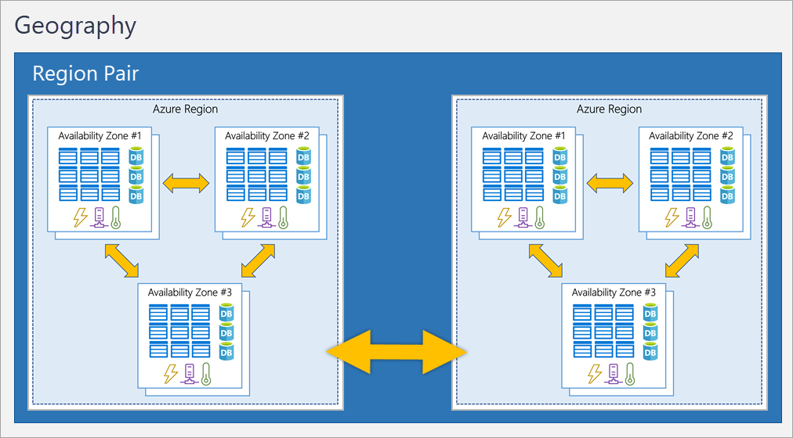
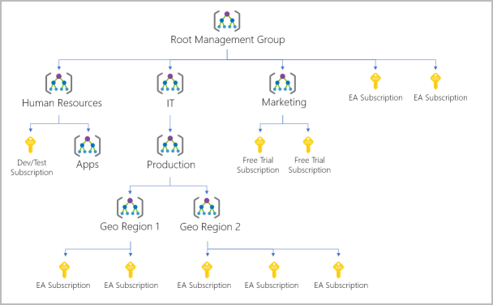

# Azure infrastructure

Azure is structured into sub parts.

There is a **physical structure**, in which every datacenter is located in an [[azure-availability-zones]], each Availability zone is located within an [[azure-region]], and Regions are coupled in [[azure-region-pairs]].

There is a sort of **logical infrastructure** used to manage resources: [[resource-groups]] are grouped in [[subscriptions]], which in turn are grouped in [[management-groups]].

