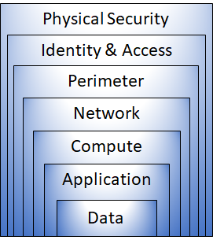

# Defense-in-depth strategy

The objective of defense-in-depth is to **protect information and prevent it from being stolen** by those who aren't authorized to access it.

Defense-in-depth is a set of layers, where each layer is an additional protection.

This approach has several advantages:

- it does not rely on a single security layer;
- it slows down attacks, given that there are more layers to be attacked,
- it provides automatic alerts

Each layer has a specific purpose.

## Physical security

It's the security of the physical assets (buildings, hardware, datacenter).

The intent is to prevent assets from being damaged or stolen.

## Identity and access

The identity and access layer ensures that identities are secure, that access is granted only to what's needed, and that sign-in events and changes are logged.

At this layer, it's important to:

- Control access to infrastructure and change control.
- Use single sign-on (SSO) and multifactor authentication.
- **Audit** events and changes.

## Perimeter

Protects from network-based attacks against your resource, such as [[DDoS]] attacks and other malicious attacks.

It uses a DDoS filter and other technologies, such as a [[firewall]].

## Network

Limits the network connectivity across all your resources to **allow only what's required**. By limiting this communication, you reduce the risk of an attack spreading to other systems in your network.

It defines several restrictions to avoid malicious access to resources, such as:

- Limit communication between resources.
- **Deny by default**.
- **Restrict inbound internet access** and limit outbound access where appropriate.
- Implement secure connectivity to on-premises networks.

## Compute

Secure existing computing resources, such as Virtual Machines and Endpoints.

## Application

Every development team should ensure that its applications are **secure by default**.

At this layer, it's important to:

- Ensure that applications are secure and free of vulnerabilities.
- Store **sensitive application** secrets in a secure storage medium.
- Make security a design requirement for all application development.

## Data

Ensure that data is stored properly, with the correct level of confidentiality, integrity, and availability.
